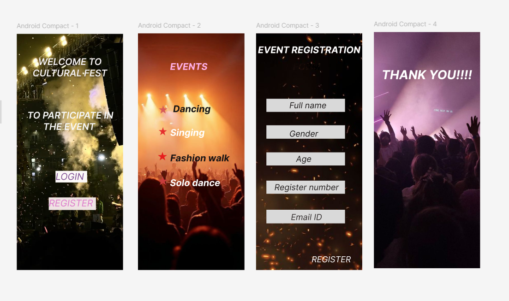

# Ex09 Event Registration Web Application
## Date:14.05.2025

## AIM:
To design, develop and deploy a web application for event registration.

## DESIGN STEPS:

### Step 1:
Create a new frame.

### Step 2:
Select any one preset size of your choice.

### Step 3:
Select the shapes you need.

### Step 4:
Import images as needed.

### Step 5:
Create pages based on your need and link them.

### Step 6:

Validate the HTML and CSS code.

### Step 6:

Publish the website in the given URL.

## DESIGN TOOL:
Figma

## CODE:
```
page 1

HTML 
<div class="container--0-">
<div class="text-0-1-1">WELCOME TO CULTURAL FEST</div>
  <div class="text-0-1-2">TO PARTICIPATE IN THE EVENT <br /></div>
  <svg
    width="123"
    height="45"
    viewBox="0 0 123 45"
    fill="none"
    xmlns="http://www.w3.org/2000/svg"
  >
    <rect width="123" height="45" fill="#FCF9F8"></rect>
  </svg>
  <div class="text-0-1-5">LOGIN<br /></div>
  <svg
    width="183"
    height="49"
    viewBox="0 0 183 49"
    fill="none"
    xmlns="http://www.w3.org/2000/svg"
  >
    <path d="M0 0H183V49H0V0Z" fill="#EFE3E3"></path>
  </svg>
  <div class="text-0-1-7">REGISTER<br /></div>
</div>

CSS

.container--0- {
  position: absolute;
  left: -19px;
  top: 12px;
  width: 412px;
  height: 917px;
  background-color: #ffffff;
  justify-content: start;
  align-items: start;
}
.text-0-1-1 {
  width: 422px;
  height: 15px;
  color: #f3efef;
  box-shadow: 0px 4px 4px 0 #000000;
  font-size: 36px;
  font-family: Inter, "Semi Bold Italic";
  font-weight: 600;
  text-align: center;
  vertical-align: top;
}
.text-0-1-2 {
  width: 383px;
  height: 94px;
  color: #f7f8f8;
  font-size: 36px;
  font-family: Inter, "Semi Bold Italic";
  font-weight: 600;
  text-align: center;
  vertical-align: top;
}
.text-0-1-5 {
  width: 111px;
  height: 88px;
  color: #815195;
  font-size: 36px;
  font-family: Inter, "Italic";
  font-weight: 400;
  text-align: center;
  vertical-align: top;
}
.text-0-1-7 {
  width: 172px;
  height: 109px;
  color: #de7bcc;
  font-size: 36px;
  font-family: Inter, "Italic";
  font-weight: 400;
  text-align: center;
  vertical-align: top;
}

page 2
HTML

<div class="container--0-">
<svg
    width="35"
    height="33"
    viewBox="0 0 35 33"
    fill="none"
    xmlns="http://www.w3.org/2000/svg"
  >
    <path
      d="M17.5 0L21.429 12.4377H34.1435L23.8572 20.1246L27.7862 32.5623L17.5 24.8754L7.21376 32.5623L11.1428 20.1246L0.85651 12.4377H13.571L17.5 0Z"
      fill="#D65B5B"
    ></path>
  </svg>
  <div class="text-0-1-2">EVENTS</div>
  <svg
    width="33"
    height="34"
    viewBox="0 0 33 34"
    fill="none"
    xmlns="http://www.w3.org/2000/svg"
  >
    <path
      d="M17.1115 0.678446L20.3599 13.1986L32.47 13.682L22.3675 20.9366L25.616 33.4568L16.1239 25.4201L6.02147 32.6746L10.2575 20.4532L0.765419 12.4165L12.8755 12.8999L17.1115 0.678446Z"
      fill="#E52E2E"
    ></path>
  </svg>
  <div class="text-0-1-4">Dancing</div>
  <div class="text-0-1-5">Singing<br /></div>
  <div class="text-0-1-6">Fashion walk</div>
  <div class="text-0-1-7">Solo dance</div>
  <svg
    width="38"
    height="34"
    viewBox="0 0 38 34"
    fill="none"
    xmlns="http://www.w3.org/2000/svg"
  >
    <path
      d="M19 0L23.2658 12.7832H37.0701L25.9022 20.6836L30.1679 33.4668L19 25.5664L7.83208 33.4668L12.0978 20.6836L0.929926 12.7832H14.7342L19 0Z"
      fill="#E71D1D"
    ></path></svg
  ><svg
    width="39"
    height="35"
    viewBox="0 0 39 35"
    fill="none"
    xmlns="http://www.w3.org/2000/svg"
  >
    <path
      d="M19.5 0L24.1025 13.1287H38.9967L26.9471 21.2426L31.5496 34.3713L19.5 26.2574L7.4504 34.3713L12.0529 21.2426L0.00334167 13.1287H14.8975L19.5 0Z"
      fill="#C63C3C"
    ></path>
  </svg>
</div>

CSS

.container--0- {
  position: absolute;
  left: 451px;
  top: 10px;
  width: 413px;
  height: 919px;
  background-color: #ffffff;
  justify-content: start;
  align-items: start;
}
.text-0-1-2 {
  width: 316px;
  height: 44px;
  color: #ffafe7;
  font-size: 36px;
  font-family: Inter, "Bold Italic";
  font-weight: 700;
  text-align: center;
  vertical-align: top;
}
.text-0-1-4 {
  width: 146px;
  height: 44px;
  color: #161414;
  font-size: 36px;
  font-family: Inter, "Bold Italic";
  font-weight: 700;
  text-align: center;
  vertical-align: top;
}
.text-0-1-5 {
  width: 134px;
  height: 88px;
  color: #ffffff;
  font-size: 36px;
  font-family: Inter, "Bold Italic";
  font-weight: 700;
  text-align: center;
  vertical-align: top;
}
.text-0-1-6 {
  width: 230px;
  height: 44px;
  color: #191414;
  font-size: 36px;
  font-family: Inter, "Bold Italic";
  font-weight: 700;
  text-align: center;
  vertical-align: top;
}
.text-0-1-7 {
  width: 195px;
  height: 44px;
  color: #ffffff;
  font-size: 36px;
  font-family: Inter, "Bold Italic";
  font-weight: 700;
  text-align: center;
  vertical-align: top;
}

page 3

HTML

<div class="container--0-">
<div class="text-0-1-1">EVENT REGISTRATION</div>
  <div class="text-0-1-2">FORM<br /></div>
  <svg
    width="305"
    height="51"
    viewBox="0 0 305 51"
    fill="none"
    xmlns="http://www.w3.org/2000/svg"
  >
    <rect width="305" height="51" fill="#D9D9D9"></rect></svg
  ><svg
    width="305"
    height="52"
    viewBox="0 0 305 52"
    fill="none"
    xmlns="http://www.w3.org/2000/svg"
  >
    <rect width="305" height="52" fill="#D9D9D9"></rect></svg
  ><svg
    width="305"
    height="51"
    viewBox="0 0 305 51"
    fill="none"
    xmlns="http://www.w3.org/2000/svg"
  >
    <rect width="305" height="51" fill="#D9D9D9"></rect></svg
  ><svg
    width="305"
    height="51"
    viewBox="0 0 305 51"
    fill="none"
    xmlns="http://www.w3.org/2000/svg"
  >
    <rect width="305" height="51" fill="#D9D9D9"></rect></svg
  ><svg
    width="305"
    height="53"
    viewBox="0 0 305 53"
    fill="none"
    xmlns="http://www.w3.org/2000/svg"
  >
    <rect width="305" height="53" fill="#D9D9D9"></rect>
  </svg>
  <div class="text-0-1-8">Email ID</div>
  <div class="text-0-1-9">Full name</div>
  <div class="text-0-1-10">Gender<br /></div>
  <div class="text-0-1-11">Age</div>
  <div class="text-0-1-12">Register number</div>
  <div class="text-0-1-14">REGISTER</div>
</div>

CSS

.container--0- {
  position: absolute;
  left: 909px;
  top: 10px;
  width: 412px;
  height: 919px;
  background-color: #ffffff;
  justify-content: start;
  align-items: start;
}
.text-0-1-1 {
  width: 398px;
  height: 44px;
  color: #ffffff;
  font-size: 36px;
  font-family: Inter, "Bold Italic";
  font-weight: 700;
  text-align: center;
  vertical-align: top;
}
.text-0-1-8 {
  width: 121px;
  height: 39px;
  color: #322d2d;
  font-size: 32px;
  font-family: Inter, "Italic";
  font-weight: 400;
  text-align: center;
  vertical-align: top;
}
.text-0-1-9 {
  width: 288px;
  height: 39px;
  color: #1f1b1b;
  font-size: 32px;
  font-family: Inter, "Italic";
  font-weight: 400;
  text-align: center;
  vertical-align: top;
}
.text-0-1-10 {
  width: 112px;
  height: 78px;
  color: #181515;
  font-size: 32px;
  font-family: Inter, "Italic";
  font-weight: 400;
  text-align: center;
  vertical-align: top;
}
.text-0-1-11 {
  width: 60px;
  height: 39px;
  color: #201d1d;
  font-size: 32px;
  font-family: Inter, "Italic";
  font-weight: 400;
  text-align: center;
  vertical-align: top;
}
.text-0-1-12 {
  width: 250px;
  height: 39px;
  color: #242020;
  font-size: 32px;
  font-family: Inter, "Italic";
  font-weight: 400;
  text-align: center;
  vertical-align: top;
}
.text-0-1-14 {
  width: 153px;
  height: 39px;
  color: #ffffff;
  font-size: 32px;
  font-family: Inter, "Italic";
  font-weight: 400;
  text-align: center;
  vertical-align: top;
}

page 4

HTML
<div class="container--0-">
<div class="text-0-1-1">THANK YOU!!!!</div>
</div>

CSS

.container--0- {
  position: absolute;
  left: 1366px;
  top: 5px;
  width: 412px;
  height: 917px;
  background-color: #ffffff;
  justify-content: start;
  align-items: start;
}
.text-0-1-1 {
  width: 351px;
  height: 58px;
  color: #ffffff;
  font-size: 48px;
  font-family: Inter, "Bold Italic";
  font-weight: 700;
  text-align: center;
  vertical-align: top;

```

## OUTPUT:


## RESULT:
The program to design, develop and deploy a web application for event registration is completed successfully.
